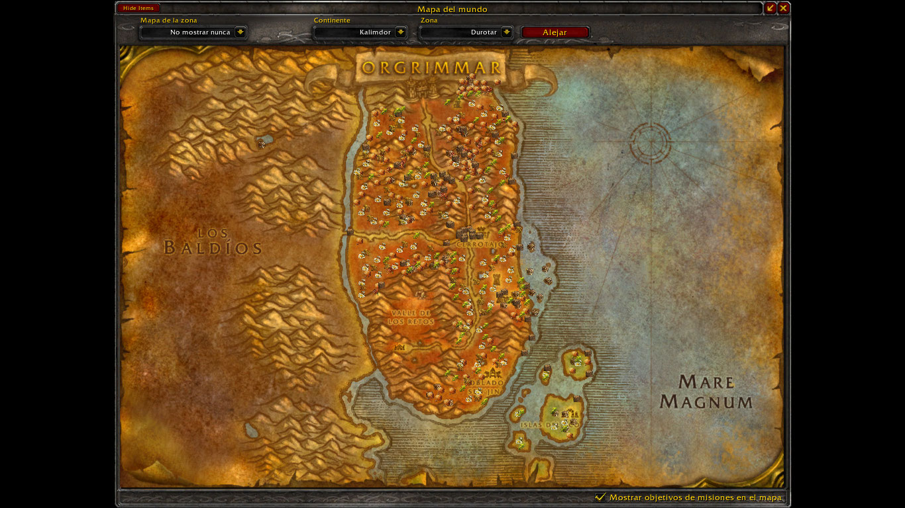
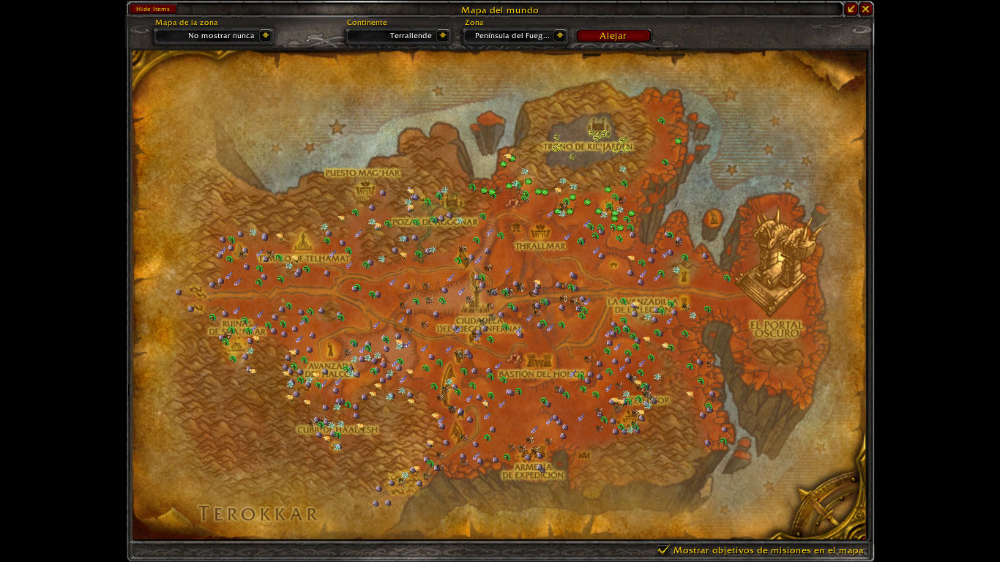
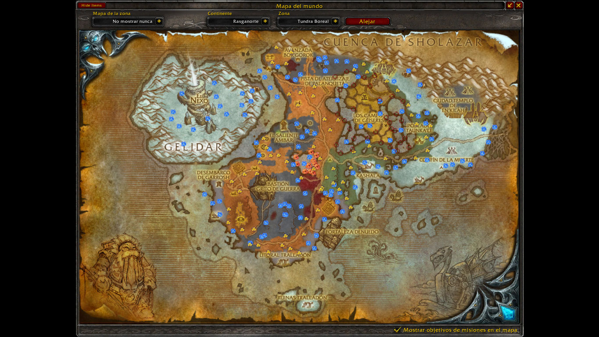

# gatherer-database-3.3.5a-azerothcore

Database generator for the Gatherer addon (version 3.1.16). Data obtained from AzerothCore.

Project repository link: [Lhezver/gatherer-database-3.3.5a-azerothcore](https://github.com/Lhezver/gatherer-database-3.3.5a-azerothcore)

## Overview

This project provides a database and generation tool for the **Gatherer** addon (version 3.1.16) in World of Warcraft (patch 3.3.5a). The data is automatically extracted from an **AzerothCore** database.

## Contents

* **`Gatherer.lua`**: Pre-generated file containing all the gathered node data.
* **`Gatherer-3.1.16.zip`**: The core addon files required for World of Warcraft.
* **`generate_gatherer.js`**: Node.js script located in the root of the repository used to regenerate the `Gatherer.lua` file from your database.

## Installation & Setup

### 1. Install the Addon

Extract the contents of `Gatherer-3.1.16.zip` into your World of Warcraft AddOns directory:

```
World of Warcraft\Interface\AddOns\
```

### 2. Install the Saved Variables (Quick Start)

If you just want to use the pre-generated database without running the script, place the `Gatherer.lua` file into your account's SavedVariables folder:

```
World of Warcraft\WTF\Account\{your-account-name}\SavedVariables\
```

## Generating the Database (Optional)

If you have an active AzerothCore database and want to build the file yourself using the root script:

1. Make sure you have [Node.js](https://nodejs.org/) installed.
2. Install the required MySQL dependency:
   ```bash
   npm install
   ```
3. Run the generator script:
   ```bash
   npm start
   ```
   *(This executes `generate_gatherer.js` from the repository root).*

## Screenshots

Here is how the addon looks in-game, displaying all ore veins, herbs, and treasure chests directly on the World of Warcraft maps:

| Map View 1 | Map View 2 | Map View 3 |
| :---: | :---: | :---: |
|  |  |  |